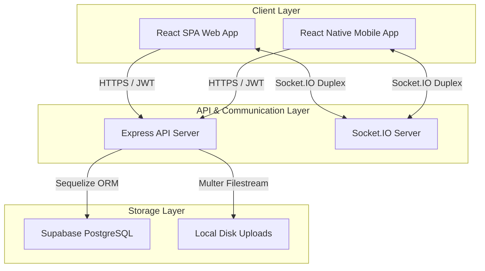

# 🛠️ Moseva Service Marketplace — Comprehensive Developer Manual

Welcome to the **Moseva Developer Manual**. This technical handbook provides an end-to-end operational blueprint of Moseva’s architecture, data flows, core sub-systems, security standards, and local/production deployment playbooks. It is designed to get new developers fully operational on the codebase within minutes.

---

## 🗺️ 1. Technical Architecture & System Overview

Moseva is organized as a unified monorepo containing three core micro-applications:
1. **`backend/`**: A Node.js & Express RESTful API gateway managing DB models via Sequelize, WebSockets via Socket.IO, security middleware, JWT authentication, and file uploading.
2. **`frontend/`**: A React 19 (Vite) Single Page Application styled with premium custom HSL CSS, managing state through Redux Toolkit, real-time message routing, and Google Identity Services.
3. **`mobile/`**: A React Native mobile client utilizing secure local storage and the native Android Google Sign-In SDK.

### 🔄 System Data Flow & Architecture


---

## 📂 2. Core Codebase Directory Structure

```
moseva-dev/
├── backend/
│   ├── src/
│   │   ├── config/       # Database connections, Socket.IO CORS, Winston loggers
│   │   ├── controllers/  # API business logic handlers (Auth, Jobs, Proposals, Admin)
│   │   ├── middleware/   # JWT parsing, Joi payload validation, RBAC, Multer filters
│   │   ├── models/       # Sequelize active schemas & association mappings (9 models)
│   │   ├── routes/       # Express router endpoints (Auth, Users, Jobs, Admin, etc.)
│   │   ├── services/     # Core services (Google OAuth profile parsing, silent JWTs)
│   │   ├── utils/        # Winston transport wrappers, custom ApiError catchers
│   │   └── validators/   # Joi payload validation schemas
│   ├── Dockerfile        # Node 20 alpine production image builder
│   ├── server.js         # Express HTTP listener & Socket handler entrypoint
│   └── package.json
├── frontend/
│   ├── src/
│   │   ├── assets/       # Global assets & styling constants
│   │   ├── components/   # NavBar, ProtectedRoutes layouts
│   │   ├── pages/        # Dashboard, Admin Panel, Marketplace, Chat, Login
│   │   ├── services/     # Axios client connectors, WebSocket Socket managers
│   │   ├── store/        # Redux Toolkit store config and feature slices
│   │   ├── index.css     # Theme tokens (Moseva Space-Navy & Pantone Orange/Red CSS)
│   │   └── main.jsx      # React App entrypoint
│   ├── Dockerfile        # Static Vite multi-stage build server
│   └── package.json
└── mobile/
    ├── src/
    │   ├── context/      # React Context state layers (AuthContext, ChatContext)
    │   ├── screens/      # LoginScreen, ExploreScreen, ProposalSubmission
    │   └── services/     # Mobile Axios connectors & endpoints
    └── package.json
```

---

## 🔐 3. Authentication & Session Lifecycles

Moseva implements a premium, secure dual-refresh token system designed to protect endpoints while maintaining frictionless user sessions.

### 🔑 3.1 Session Token Exchange Workflow
```
[Client]                               [Express backend]                  [PostgreSQL]
   |                                           |                                |
   |--- 1. POST /auth/login ------------------>|                                |
   |                                           |--- 2. Verify Pass/Hash ------->|
   |                                           |<-- 3. Return user profile -----|
   |<-- 4. Set Refresh Cookie (httpOnly) ------|                                |
   |      & Send AccessToken (JSON body) ------|                                |
   |                                           |                                |
   |--- 5. GET /jobs (Header: Bearer) -------->|                                |
   |       [Token Expiry Detected: 401]        |                                |
   |<-- 6. Returns 401 Unauthorized -----------|                                |
   |                                           |                                |
   |--- 7. POST /auth/refresh ---------------->|                                |
   |       (Cookie sent automatically)         |--- 8. Validate Refresh Token ->|
   |<-- 9. Returns new AccessToken ------------|                                |
   |                                           |                                |
   |--- 10. RETRY GET /jobs (New Token) ------>|                                |
   |<-- 11. Returns Job Lists -----------------|                                |
```

### 🤝 3.2 Google OAuth Authentication Flow (Web & Android)
Moseva uses Google Identity Services to allow frictionless onboarding. The backend coordinates validation with Google's OAuth servers and creates or logs in users seamlessly.

* **Backend Gateway Endpoint**: `/api/v1/auth/google` (handled by [auth.controller.js](file:///Users/omys/Code/moseva-dev/backend/src/controllers/auth.controller.js) and [auth.service.js](file:///Users/omys/Code/moseva-dev/backend/src/services/auth.service.js)).
* **Token Verification**: Uses Google's `google-auth-library` to fetch and verify the `idToken` sent from clients:
  ```javascript
  const ticket = await client.verifyIdToken({
    idToken,
    audience: process.env.GOOGLE_CLIENT_ID
  });
  const payload = ticket.getPayload(); // verified email, name, avatar
  ```
* **Avatar & Profile Sync**: Google profile images are parsed and synced as the user's primary marketplace avatar (`avatarUrl`). If it is a new user, a secure randomized username is generated.

---

## 🗄️ 4. Database Schema & Synchronization Strategy

Moseva utilizes **PostgreSQL** as its data engine, integrated through **Sequelize**.

### 🌟 4.1 Schema Auto-Alteration Boot Configuration
To support continuous integration without database lockouts, database synchronization is set to automatically alter live tables upon server boot.
* **Location**: [database.js](file:///Users/omys/Code/moseva-dev/backend/src/config/database.js)
* **Code Implementation**:
  ```javascript
  // Auto-sync tables to ensure schema matches local definitions
  await sequelize.sync({ alter: true });
  console.log('Database tables synchronized successfully.');
  ```
* **Operational Impact**: When new columns, indexes, or roles (such as `superadmin`) are introduced in the codebase, the server automatically queries the catalog tables and executes safe `ALTER TABLE` operations on the live PostgreSQL instance without losing existing data.

### 🛡️ 4.2 Superadmin Seeding
Platform root permissions are managed by a secure, high-entropy seeding script that sets up a verified superadmin user.
* **Run Script Command**: `node src/scripts/seed-superadmin.js`
* **Default Seeding Parameters**:
  * **Email**: `superadmin@moseva.com`
  * **Username**: `superadmin`
  * **Role**: `superadmin`
  * **Status**: `isActive = true`, `isVerified = true`
* **Secure Authorization Bypass**: The role-based routing middleware inside [auth.js](file:///Users/omys/Code/moseva-dev/backend/src/middleware/auth.js) grants the `superadmin` role full system bypass privileges:
  ```javascript
  if (req.user && req.user.role === 'superadmin') {
    return next(); // Complete access bypass across all routes
  }
  ```

---

## 📊 5. Backoffice & Regulatory DPDP Compliance

Moseva includes complete operational and regulatory cells managed directly from the premium glassmorphic **Admin Operations Cell**:

### 🛡️ 5.1 DPDP Act Compliance & Data Erasure
Under India's **Digital Personal Data Protection (DPDP) Act**, users have the legal right to request the erasure of their personal data.
1. **User Request**: Users navigate to the *Support & Grievances* tab inside their dashboard to submit an erasure claim.
2. **Backoffice Audit**: The claim populates the **DPDP Cell Registry** on the Admin Panel.
3. **Execution**: The Steward reviews the audit log and executes **Erase & Deactivate User**. This sets `isActive = false`, log-records the compliance audit trail in the database, and timestamps the erasure completion date (`completedAt`), maintaining a clean, legally-compliant registry.

---

## 🚀 6. GCP Cloud Run Deployment Pipeline

Moseva services are deployed as serverless containers on **Google Cloud Run** targeting the `us-central1` region.

### 📦 6.1 Building & Deploying the Backend
Navigate to the `backend/` directory and execute:
```bash
gcloud run deploy moseva-backend \
  --source . \
  --region us-central1 \
  --project moseva-496617 \
  --allow-unauthenticated
```
* **VPC & Database Hook**: Connects to the cloud **Supabase PostgreSQL** instance (`db.hpktysxjplmteyswmpic.supabase.co`).
* **Environment Variables**: Managed inside GCP console or via Cloud Run configurations:
  * `DATABASE_URL`: Cloud Database connection string.
  * `NODE_ENV`: `production` (enables TLS SSL Postgres handshakes).
  * `GOOGLE_CLIENT_ID`: OAuth client ID key.

### 🖥️ 6.2 Building & Deploying the Web Frontend
Navigate to the `frontend/` directory and execute:
```bash
gcloud run deploy moseva-frontend \
  --source . \
  --region us-central1 \
  --project moseva-496617 \
  --allow-unauthenticated
```
* **Static Builder**: Multi-stage docker file builds Vite assets, compiles CSS, and serves static built chunks via the container-exposed port `8080`.

---

## 🔒 7. Developer Security Standards

Developers contributing to Moseva must strictly adhere to the following security guidelines:
1. **No Plaintext Passwords in Code/Docs**: Sensitive passwords or keys (such as default seed passwords) must **never** be written inside standard markdown manuals, readme files, or checked into Git repositories. Always reference them dynamically or instruct the reader to check safe environment variables (`.env`).
2. **Always Use parameterized ORM Queries**: Never write raw SQL concatenations. Always leverage Sequelize models to protect database operations against SQL injections.
3. **JWT and httpOnly Storage**: Always store session refresh tokens inside secure, `httpOnly`, `sameSite: strict` cookie domains to mitigate Cross-Site Scripting (XSS) risks.
